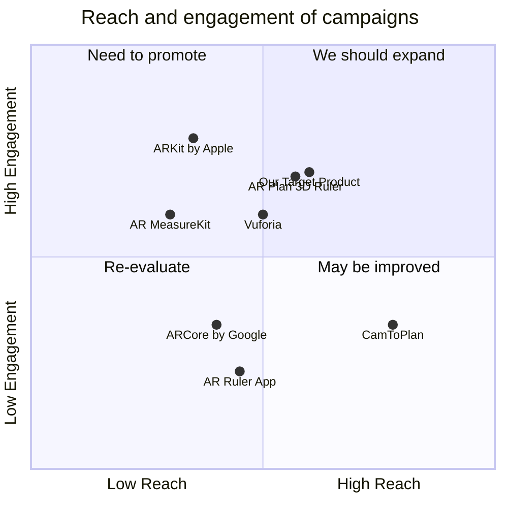

## Original Requirements
The boss wants a mobile application developed that uses a device's camera and sensors to create an augmented reality (AR) environment for classifying boccia balls. The application should be able to accurately identify a small boccia ball and six large boccia balls using real-time image recognition. It should also measure the distance between the small boccia ball and each of the six large boccia balls, providing precise measurements. The app should provide an AR visualization of the boccia balls and the distance measurements, order the six large boccia balls in ascending order of proximity to the small boccia ball, and have a user-friendly interface. The app should be accurate, precise, compatible with both Android and iOS platforms, include a calibration process, provide clear instructions, and possibly incorporate multi-lingual support.

## Product Goals
```python
[
    "Develop an AR mobile app for classifying and measuring distances between boccia balls",
    "Ensure the app is user-friendly, accurate, and compatible with both Android and iOS platforms",
    "Incorporate a calibration process and possibly multi-lingual support"
]
```

## User Stories
```python
[
    "As a user, I want to classify boccia balls using real-time image recognition",
    "As a user, I want to measure the distance between the small boccia ball and each of the six large boccia balls",
    "As a user, I want to view the boccia balls and the distance measurements in an AR environment",
    "As a user, I want the six large boccia balls to be arranged in ascending order of proximity to the small boccia ball",
    "As a user, I want to easily initiate the object recognition process, view AR measurements, and access the ordered list of boccia balls"
]
```

## Competitive Analysis
```python
[
    "AR MeasureKit: Offers AR measuring but lacks object recognition and specific boccia ball classification",
    "AR Ruler App: Provides AR measuring tools but doesn't support object recognition or boccia ball classification",
    "AR Plan 3D Ruler: Allows AR measurement and 3D visualization but lacks object recognition and boccia ball classification",
    "CamToPlan: Offers AR distance measurement but doesn't support object recognition or boccia ball classification",
    "ARCore by Google: Provides AR capabilities but lacks specific tools for boccia ball classification and measurement",
    "ARKit by Apple: Offers AR tools but doesn't support specific boccia ball classification and measurement",
    "Vuforia: Provides AR and object recognition capabilities but lacks specific boccia ball classification and measurement tools"
]
```

## Competitive Quadrant Chart


## Requirement Analysis
The product should be a mobile application that uses AR and object recognition to classify and measure distances between boccia balls. It should be user-friendly, accurate, compatible with both Android and iOS platforms, and possibly support multiple languages.

## Requirement Pool
```python
[
    ("Develop real-time object recognition system for boccia balls", "P0"),
    ("Implement AR visualization and distance measurement between boccia balls", "P0"),
    ("Design user-friendly interface for initiating object recognition and viewing AR measurements", "P0"),
    ("Ensure compatibility with both Android and iOS platforms", "P0"),
    ("Incorporate calibration process and possibly multi-lingual support", "P1")
]
```

## UI Design draft
The app should have a clean and intuitive interface. The main screen should display the camera feed with an AR overlay for the boccia balls and distance measurements. There should be buttons for initiating the object recognition process, viewing AR measurements, and accessing the ordered list of boccia balls. The app should use bright, contrasting colors for easy visibility.

## Anything UNCLEAR
There are no unclear points.