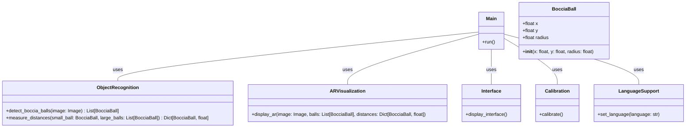
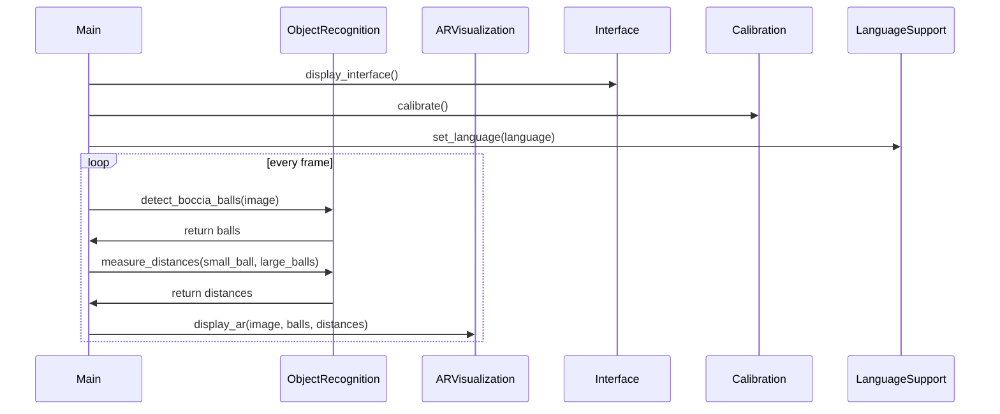

## Implementation approach
To implement this AR mobile application, we will use Python with Kivy for cross-platform mobile app development, OpenCV for real-time image recognition, and ARCore/ARKit for AR capabilities on Android and iOS respectively. 

The main challenges will be:
1. Implementing real-time object recognition for boccia balls. We will use OpenCV for this, which is a powerful open-source computer vision library.
2. Creating an AR visualization of the boccia balls and distance measurements. We will use ARCore for Android and ARKit for iOS, which are Google's and Apple's AR platforms respectively.
3. Ensuring compatibility with both Android and iOS platforms. We will use Kivy, a Python library for developing multitouch applications. It's cross-platform (Linux/OS X/Windows/Android/iOS) and released under the MIT license. It is particularly good for applications that require multi-touch, gestures, and other modern touch features.
4. Designing a user-friendly interface. We will use Kivy's robust widget library for this.
5. Incorporating a calibration process and possibly multi-lingual support. We will use OpenCV for the calibration process and Python's built-in gettext module for multi-lingual support.

## Python package name
```python
"boccia_ar_app"
```

## File list
```python
[
    "main.py",
    "object_recognition.py",
    "ar_visualization.py",
    "interface.py",
    "calibration.py",
    "language_support.py"
]
```

## Data structures and interface definitions


## Program call flow


## Anything UNCLEAR
The requirement is clear to me.